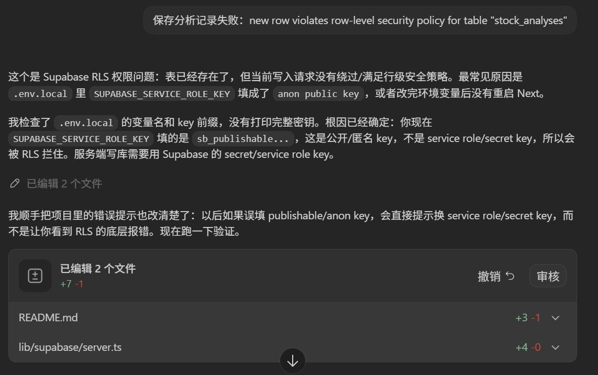

# AI 股票分析面板

一个 Next.js 全栈单体应用：输入 A 股股票代码，调用 Tushare 获取数据，再调用 LLM 返回严格 JSON 分析，并把原始数据和分析结果保存到 Supabase。

[在线访问](https://ai-stock-analysis-panel-9stk.onrender.com/)(首次访问可能会有启动过程需等待一会)

## 功能

- A 股代码标准化：支持 `000001`、`600000`、`000001.SZ` 等输入。
- Tushare 数据获取：近期非复权日线行情，适配 120 积分免费账号。
- 股票名称兜底：使用免登录行情元数据接口补齐名称，失败时仍可显示股票代码。
- AI 分析：返回 `summary`、`sentiment`、`risk_level`、`key_factors`、`risks`、`confidence`。
- Supabase 存储：保存原始 Tushare 响应、标准化数据和 AI JSON。
- 单页面板：数据概览、AI 分析结果和最近分析记录。

## 本地运行

```bash
npm install
cp .env.example .env.local
npm run dev
```

在 `.env.local` 中填入：

```bash
TUSHARE_TOKEN=your_tushare_token
LLM_API_KEY=your_llm_api_key
LLM_BASE_URL=https://api.openai.com/v1
LLM_MODEL=gpt-4o-mini
NEXT_PUBLIC_SUPABASE_URL=https://your-project.supabase.co
SUPABASE_SERVICE_ROLE_KEY=your_supabase_service_role_or_secret_key
```

## Tushare 权限说明

120 积分账号默认只能调用 `daily` 股票非复权日线行情。本项目第一版默认只用 Tushare 调用 `daily`，不会调用 `stock_basic`、`daily_basic` 等更高积分接口。行业、上市日期这类字段需要更高权限接口，因此页面仅展示昨收、涨跌额、成交量、成交额等日线指标。

## Supabase 建表

在 Supabase SQL Editor 中执行：

```sql
create extension if not exists "pgcrypto";

create table if not exists public.stock_analyses (
  id uuid primary key default gen_random_uuid(),
  stock_code text not null,
  stock_name text,
  raw_data jsonb not null,
  normalized_data jsonb not null,
  analysis jsonb not null,
  created_at timestamptz not null default now()
);

create index if not exists stock_analyses_created_at_idx
  on public.stock_analyses (created_at desc);

create index if not exists stock_analyses_stock_code_idx
  on public.stock_analyses (stock_code);
```

## Render 部署

1. 连接到 GitHub。
2. 在 Render 新建 Web Service，连接该仓库。
3. 设置：
   - Build Command: `npm install && npm run build`
   - Start Command: `npm start`
4. 在 Render Environment 中配置 `.env.example` 中的所有变量。

## 测试

```bash
npm test
npm run build
```

# 技术栈说明

## 🏗️ 架构层次

### 前端层（Client）
- **框架**：React 19.1.0（服务端组件与客户端交互）
- **语言**：TypeScript 5.8.3
- **UI 状态管理**：React Hooks（useState、useEffect、useMemo）
- **类型检查**：Zod 3.24.4（运行时验证）

### 后端层（Server）
- **框架**：Next.js 15.3.2（App Router + API Routes）
- **运行时**：Node.js
- **API 通信**：RESTful（JSON 格式）

### 数据层（Database）
- **数据库**：Supabase PostgreSQL
- **SDK**：@supabase/supabase-js 2.49.4
- **ORM/查询方式**：Supabase PostgREST API

### 外部服务
- **股票数据**：Tushare API（A 股非复权日线行情）
- **AI 分析**：OpenAI API 兼容服务（如 GPT-4o-mini）
  
---

## 📦 核心依赖

### 生产依赖

| 包名 | 版本 | 用途 |
|------|------|------|
| `next` | ^15.3.2 | 全栈 Web 框架，SSR、API Routes、构建工具 |
| `react` | ^19.1.0 | 组件库与状态管理 |
| `react-dom` | ^19.1.0 | React DOM 渲染 |
| `@supabase/supabase-js` | ^2.49.4 | PostgreSQL 客户端，认证与实时数据库访问 |
| `zod` | ^3.24.4 | 运行时 Schema 验证与类型推导 |

### 开发依赖

| 包名 | 版本 | 用途 |
|------|------|------|
| `typescript` | ^5.8.3 | 静态类型检查与编译 |
| `@types/node` | ^22.15.18 | Node.js 类型定义 |
| `@types/react` | ^19.1.4 | React 类型定义 |
| `@types/react-dom` | ^19.1.5 | React DOM 类型定义 |
| `vitest` | ^3.1.3 | 单元测试框架（Vite 原生） |
| `@testing-library/react` | ^16.3.0 | React 组件测试工具 |
| `@testing-library/jest-dom` | ^6.6.3 | 测试断言库 |
| `eslint` | 8.57.1 | 代码检查 |
| `eslint-config-next` | ^15.3.2 | Next.js ESLint 配置 |

---

### 模块划分

```
lib/
├── analysis/
│   ├── schema.ts           # Zod 类型定义（AnalysisJson）
│   ├── llm.ts              # LLM 调用接口
│   └── repository.ts       # Supabase 数据操作（CRUD）
├── stocks/
│   ├── types.ts            # 股票数据类型定义
│   ├── tushare.ts          # Tushare API 集成
│   └── [数据标准化逻辑]
└── supabase/
    └── server.ts           # Supabase 服务端客户端初始化
```

---

## 🗄️ 数据库设计

### Supabase 表结构

```sql
CREATE TABLE public.stock_analyses (
  id UUID PRIMARY KEY DEFAULT gen_random_uuid(),
  stock_code TEXT NOT NULL,           -- 股票代码（如 000001.SZ）
  stock_name TEXT,                    -- 股票名称
  raw_data JSONB NOT NULL,            -- 原始 Tushare 响应
  normalized_data JSONB NOT NULL,     -- 标准化数据
  analysis JSONB NOT NULL,            -- AI 分析结果（结构化 JSON）
  created_at TIMESTAMPTZ NOT NULL DEFAULT now()
);

-- 索引
CREATE INDEX stock_analyses_created_at_idx 
  ON public.stock_analyses (created_at DESC);

CREATE INDEX stock_analyses_stock_code_idx 
  ON public.stock_analyses (stock_code);
```

# 确保LLM输出标准json格式

## 系统提示词部分
```
const SYSTEM_PROMPT = `你是一个谨慎的 A 股研究助手。你只能基于用户提供的数据做研究辅助分析，不提供买入、卖出或持仓建议。你必须只返回严格 JSON，不要 Markdown，不要解释。JSON 字段必须是：summary, sentiment, risk_level, key_factors, risks, confidence。sentiment 只能是 bullish、neutral、bearish。risk_level 只能是 low、medium、high。confidence 是 0 到 100 的数字。`;
```
## 调用
调用时要求以 json object
```
response_format: { type: "json_object" },
```
## 解析校验
```
export const analysisSchema = z.object({
  summary: z.string().min(1),
  sentiment: z.enum(["bullish", "neutral", "bearish"]),
  risk_level: z.enum(["low", "medium", "high"]),
  key_factors: z.array(z.string()).default([]),
  risks: z.array(z.string()).default([]),
  confidence: z.number().min(0).max(100).default(50)
});
```
schema.ts 文件负责检查是不是真的符合格式要求。

# Debug记录
使用错supabase的key


## 📚 相关资源

- [Next.js 官方文档](https://nextjs.org)
- [Supabase 文档](https://supabase.com/docs)
- [Tushare 文档](https://www.tushare.pro)
- [Zod 文档](https://zod.dev)
- [TypeScript 官方指南](https://www.typescriptlang.org)

---

AI 分析仅用于研究辅助，不提供明确买入或卖出建议。

**最后更新**：2026-05-21
